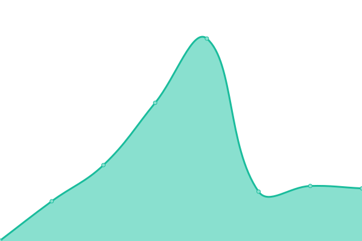
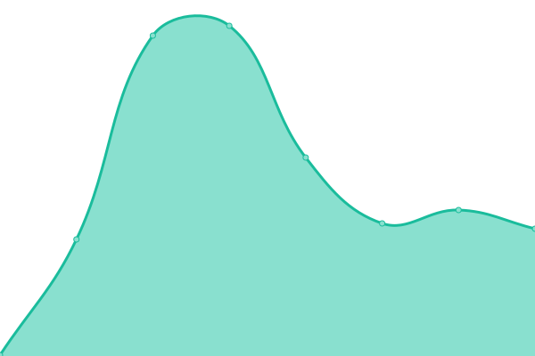
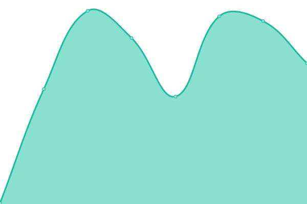
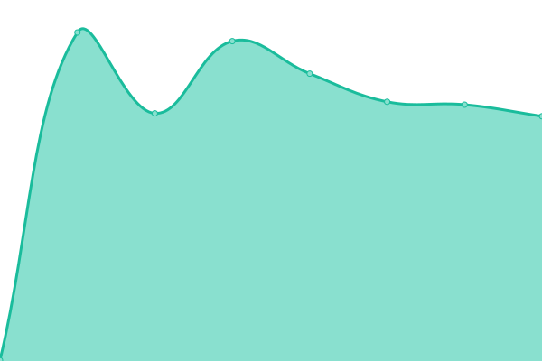

# [📈 Live Status](https://khorovatin.github.io/upptime): <!--live status--> **🟩 All systems operational**

This repository contains the open-source uptime monitor and status page for [Ken Horovatin](https://ken.horovatin.net), powered by [Upptime](https://github.com/upptime/upptime).

With [Upptime](https://upptime.js.org), you can get your own unlimited and free uptime monitor and status page, powered entirely by a GitHub repository. We use [Issues](https://github.com/khorovatin/upptime/issues) as incident reports, [Actions](https://github.com/khorovatin/upptime/actions) as uptime monitors, and [Pages](https://khorovatin.github.io/upptime) for the status page.

<!--start: status pages-->
<!-- This summary is generated by Upptime (https://github.com/upptime/upptime) -->
<!-- Do not edit this manually, your changes will be overwritten -->
<!-- prettier-ignore -->
| URL | Status | History | Response Time | Uptime |
| --- | ------ | ------- | ------------- | ------ |
|  [Horovatin Consulting Ltd.](https://www.horovatin.com) | 🟩 Up | [horovatin-consulting-ltd.yml](https://github.com/khorovatin/upptime/commits/HEAD/history/horovatin-consulting-ltd.yml) | 

 195ms
     
 | 

<a href="https://khorovatin.github.io/upptime/history/horovatin-consulting-ltd">100.00%</a>
    

|  [Personal Webpage](https://ken.horovatin.net) | 🟩 Up | [personal-webpage.yml](https://github.com/khorovatin/upptime/commits/HEAD/history/personal-webpage.yml) | 

 151ms
     
 | 

<a href="https://khorovatin.github.io/upptime/history/personal-webpage">100.00%</a>
    

|  [Sam's Personal Webpage](https://www.samuelhorovatin.com) | 🟩 Up | [sam-s-personal-webpage.yml](https://github.com/khorovatin/upptime/commits/HEAD/history/sam-s-personal-webpage.yml) | 

 157ms
     
 | 

<a href="https://khorovatin.github.io/upptime/history/sam-s-personal-webpage">100.00%</a>
    

|  [Always Care Consulting](https://alwayscare.ca) | 🟩 Up | [always-care-consulting.yml](https://github.com/khorovatin/upptime/commits/HEAD/history/always-care-consulting.yml) | 

 414ms
     
 | 

<a href="https://khorovatin.github.io/upptime/history/always-care-consulting">99.82%</a>
    

<!--end: status pages-->

[**Visit our status website →**](https://khorovatin.github.io/upptime)

## 📄 License

- Powered by: [Upptime](https://github.com/upptime/upptime)
- Code: [MIT](./LICENSE) © [Ken Horovatin](https://ken.horovatin.net)
- Data in the `./history` directory: [Open Database License](https://opendatacommons.org/licenses/odbl/1-0/)
